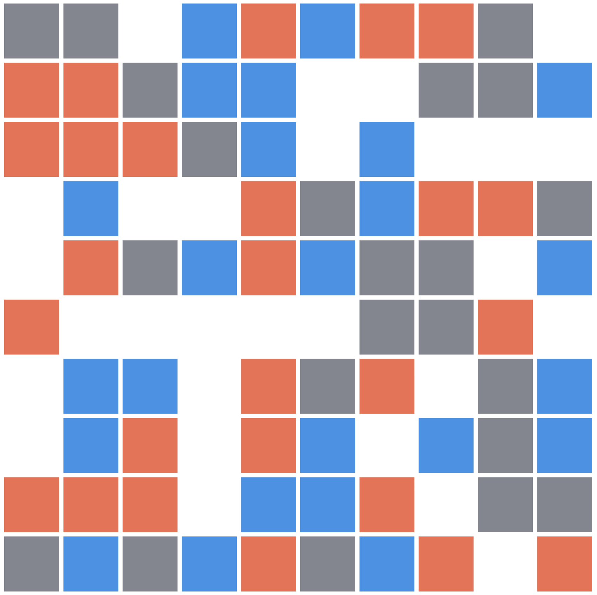

## Info
- Blockchain: Tezos
- Objkt ID: 306627
- H=N link: https://www.hicetnunc.xyz/objkt/306627
- minted 2021-09-14T19:00:42+00:00 9 ed

## Notes
- Created with D3.js (v4).
- My first interactive objkt!
- I wrote the bulk of the code for this in 2016 when learning D3.js fundamentals. Here is a blog post about that: https://cagrimmett.com/til/2016/08/17/d3-lets-make-a-grid/
- I adapted the code for an interactive objkt on H=N on 2021-09-14.
- Since it should be square, but can be opened in other sizes, the code first determines whether whether the width or the height is the limiting factor.